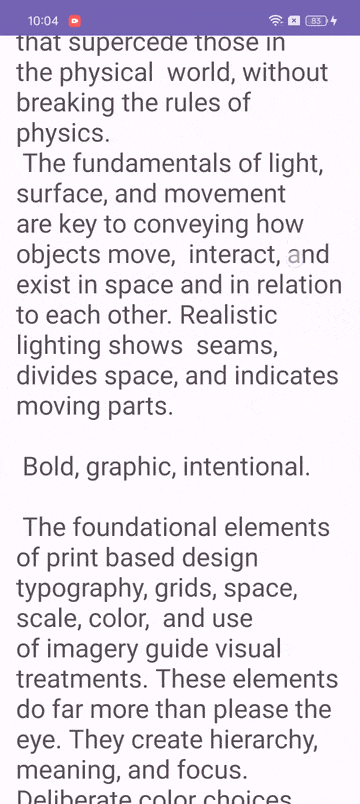

# demo-widgets
android common components demos

### demo-coordinatorlayout
Show the common usage of CoordinatorLayout in conjunction with its sub views AppBarLayout, Collapsing ToolbarLayout, and scrolling views
#### Screenshots

## Document Link
>[CoordinatorLayout 的基本使用](https://www.dafaycoding.com/article/android-basic-coordinator)

